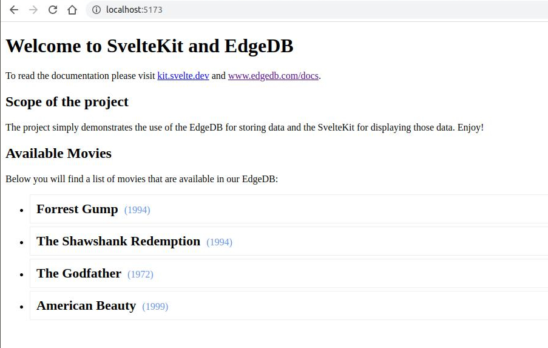

# EdgeDB through SvelteKit!

A simple web application where we are displaying a list of movies from an EdgeDB through SvelteKit!

## Scope of the project

The project simply demonstrates the use of the EdgeDB for storing data and the SvelteKit for displaying those data. 

**Enjoy!**

## Developing

Once you've created a project and installed dependencies with `npm install` (or `pnpm install` or `yarn`), start a development server:

```bash
npm run dev

# or start the server and open the app in a new browser tab
npm run dev -- --open
```

## Building

To create a production version of your app:

```bash
npm run build
```

You can preview the production build with `npm run preview`.

> To deploy your app, you may need to install an [adapter](https://kit.svelte.dev/docs/adapters) for your target environment.

## Screenshots
If you run the application you should see something like this:


